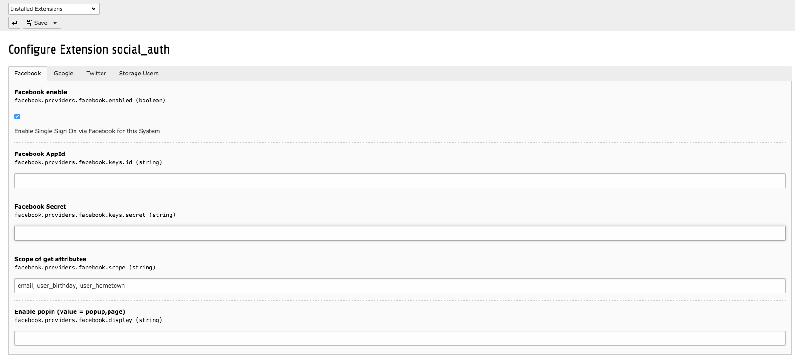

.. ==================================================
.. FOR YOUR INFORMATION
.. --------------------------------------------------
.. -*- coding: utf-8 -*- with BOM.

.. include:: ../Includes.txt

.. _users-manual:

Users manual
============

- Install the extension using the Extension Manager
- Register new app on Facebook, Twitter, Google or LinkedIn and follow the instructions. Some examples are detailed on Hybrid auth user guide [http://hybridauth.sourceforge.net/userguide.html]
- Configure via Extension Manager and add key + appId for each social provider & set options for fe_users creation (users pid and default usergroup id are required !)
- Storage User Pid should be different from classic fe_users PID to prevent unique username
- Add the static TS (typoscript) to your typoscript template
- New for 8.7 instance, set file storage uid and path for fe_users.image (FAL is used now for image field)

Extension manager: **Social auth**

	Configure social providers

**Bootstrap social CSS**

Bootstrap social css is used by default on every views. You can disable it via Constant editor

**Frontend plugin integration**

Two ways exist to integrate social auth on FE

- Add Social auth plugin on your page. It create a link for each enabled providers
- Create links on your fluid template like this (add namespace viewhelper at first)

.. code-block:: xml

	{namespace socialauth=MV\SocialAuth\ViewHelpers}
	<f:link.page pageType="1316773681" additionalParams="{tx_socialauth_pi1:{provider:'facebook',redirect:'{socialauth:currentUri()}'}}" noCacheHash="TRUE">
		Facebook
	</f:link.page>

You can change redirect URL with a custom page (like profil page) using {f:uri.page()} viewhelper instead of {socialauth:currentUri()}

**Integration with Felogin**

If felogin is used, you can add marker ###SOCIAL_AUTH### to your custom felogin template. Typoscript for Felogin is loaded on main TS

To custom renderer of generated links. Modify Typoscript like this :

.. container:: table-row

	Property
		plugin.tx_felogin_pi1
	Data type
		string
	Description
		Custom renderer of links

		::

			plugin.tx_felogin_pi1{
				socialauth.wrap = <ul>|</ul>
				socialauth_provider{
					facebook = TEXT
					facebook{
						typolink{
							#Custom class or title
							#ATagParams =
						}
						wrap = <li>|</li>
						stdWrap.dataWrap = {LLL:EXT:social_auth/Resources/Private/Language/locallang.xlf:facebook.label}
					}
					twitter < .facebook
					twitter{
						stdWrap.dataWrap = {LLL:EXT:social_auth/Resources/Private/Language/locallang.xlf:twitter.label}
					}
					google < .facebook
					google{
						stdWrap.dataWrap = {LLL:EXT:social_auth/Resources/Private/Language/locallang.xlf:google.label}
					}
				}
			}
